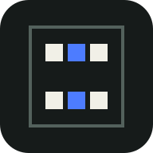
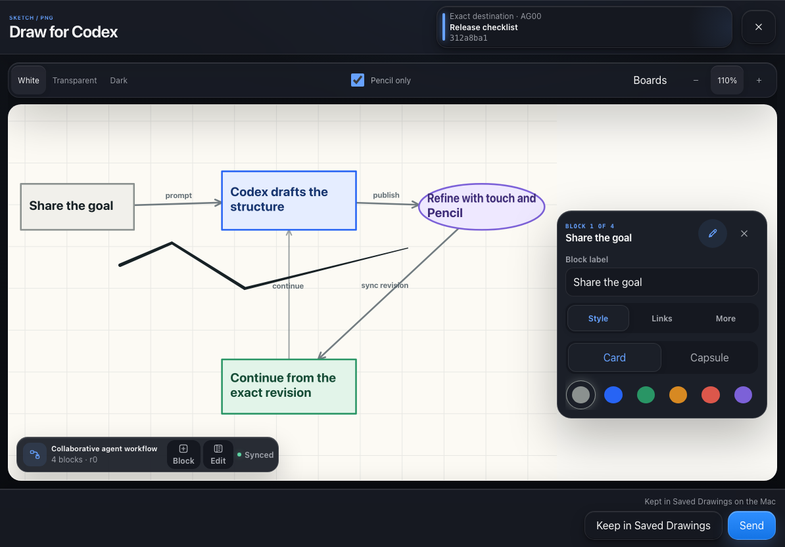
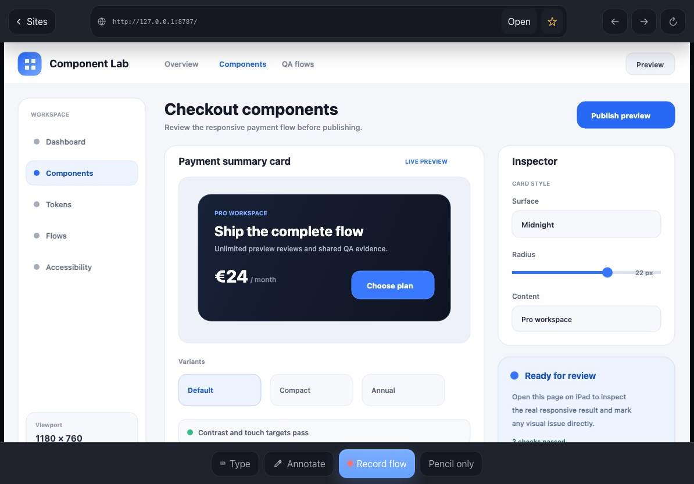

<p align="center">
  
</p>

<h1 align="center">Nerva</h1>

<p align="center">
  <strong>A touch-first iPad control surface for Codex on your Mac—with collaborative graphs, Pencil input, live-site review, and exact-task controls.</strong>
</p>

<p align="center">
  Move across active tasks, work through multiple revisioned graphs, sketch with Apple Pencil, inspect sites, and return precise visual context to the right Codex task.
</p>

<p align="center">
  <a href="https://github.com/blancmathis/nerva/actions/workflows/ci.yml"></a>
  <a href="LICENSE"></a>
  
  <a href="https://x.com/mathisbuilds"></a>
</p>

<p align="center">
  <a href="#quick-start"><strong>Install Nerva</strong></a>
  ·
  <a href="docs/product/CURRENT_STATE.md">Current status</a>
  ·
  <a href="docs/product/INDEX.md">Documentation</a>
  ·
  <a href="https://x.com/mathisbuilds">Follow the build</a>
</p>



## Work with graphs, not just prompts

Architecture is rarely one final diagram. Nerva lets each exact task publish and evolve multiple structured graphs, reopen them as working boards, and combine them with freehand Pencil annotations.

1. **Codex publishes the graph you need.** Each exact task can keep multiple structured diagrams for different systems, flows, or decisions.
2. **You choose and reshape it on the iPad.** Move blocks, edit labels and links, reorganize the architecture, then annotate freely with Apple Pencil.
3. **Nerva syncs the exact revision.** Structured edits and freehand ink remain separate, so neither side silently overwrites the other.
4. **Codex continues from your changes.** It can read the revisioned graph instead of reconstructing your intent from another paragraph.

Nerva calls this **collaborative graph engineering**: using revisioned graphs as shared working interfaces between developer and agent—not merely exporting a screenshot at the end.

Large boards remain understandable when they leave the iPad. Nerva exports a map-first visual package with named regions, overlap, neighbor references and structural connection indexes. When native multi-image attachment is not proven for the installed Codex version, it produces one compatibility atlas instead. Nothing is submitted automatically.

[Read the collaborative graph protocol →](docs/COLLABORATIVE_DIAGRAMS.md)

## One surface for the work around the agent

<table>
  <tr>
    <td width="50%">
      
      <br><strong>Your working set</strong><br>
      Keep up to twelve pinned tasks in a spatial layout, then temporarily filter the complete catalog by approval, error, working, waiting or completed state.
    </td>
    <td width="50%">
      
      <br><strong>Exact-task controls</strong><br>
      Open the same task on Mac and iPad, start native Mac dictation, submit the current composer, select skills, choose model and reasoning presets, and toggle Fast when those capabilities are verified.
    </td>
  </tr>
</table>

Nerva is not a remote desktop and does not move code execution onto the iPad. The Mac remains responsible for repositories, permissions, composition and agent execution. The iPad becomes the tactile surface around that work:

- **Think spatially.** Use the virtually infinite Draw canvas for diagrams, photos and Pencil annotations, then reopen sent boards later.
- **Show context instead of describing it.** Capture a photo, scan, file, sketch or note locally and reuse it from any task through Capture Inbox.
- **Reproduce visual bugs.** Open a Codex Browser page, navigate it from the iPad, annotate the live frame and record a privacy-reviewed Site QA flow for the exact task.
- **Stay oriented.** Follow the task selected on the Mac or deliberately keep the iPad on its current task.
- **Act only when the target is proven.** Native controls, visual delivery and site actions fail closed when Nerva cannot verify the exact task and compatible capability.

<table>
  <tr>
    <td width="50%">
      
      <br><strong>Touch-first Site Review</strong>
    </td>
    <td width="50%">
      
      <br><strong>Local Capture Inbox</strong>
    </td>
  </tr>
</table>

<p align="center"><small>Product screenshots use deterministic synthetic sessions and site content.</small></p>

## Quick start

> [!WARNING]
> Nerva is a public **pre-alpha**. Codex Desktop integration relies on undocumented, version-sensitive internals. Install it to experiment and contribute, not as a stable production dependency. Read the [current implementation state](docs/product/CURRENT_STATE.md) before setup.

### Requirements

- an Apple Silicon Mac;
- Codex Desktop installed at `/Applications/ChatGPT.app`;
- the official standalone Codex CLI;
- Node.js 22 or newer and npm;
- Tailscale signed in to the same tailnet on the Mac and iPad.

### Mac

```bash
git clone https://github.com/blancmathis/nerva.git
cd nerva
curl -fsSL https://chatgpt.com/codex/install.sh | sh
npm run setup:check
npm run setup:mac
```

Use OpenAI's installer both for a first Codex installation and to update an existing standalone package; merely having the file is not enough when its version differs from Codex Desktop. `setup:check` is read-only and reports one of three outcomes:

- **Ready:** Nerva can install and the native Codex topology is compatible enough to configure.
- **Ready with limited Codex controls:** Nerva can install, pair and provide its local/offline surfaces, but app-server-backed controls remain unavailable and no Codex daemon, writer or Desktop process is changed.
- **Blocked:** a base prerequisite or private-network safety check must be fixed before installation.

`setup:mac` installs dependencies when needed, builds Nerva, configures only the exact private Tailscale Serve route, installs the loopback bridge service, waits for bridge health and only then prints the pairing QR. A limited native result does not prevent pairing.

### iPad

1. Scan the QR in Safari.
2. Choose **Share → Add to Home Screen**.
3. Open Nerva and tap **Connect**.

The device credential persists after pairing; there is no daily QR. If iPadOS drops the invitation while installing the PWA, scan the same still-valid QR once more from Nerva's built-in scanner.

For an already installed but unpaired Nerva app:

```bash
npm run pair
```

[Detailed Mac setup](docs/SETUP_MAC.md) · [Detailed iPad setup](docs/SETUP_IPAD.md) · [Troubleshooting](docs/TROUBLESHOOTING.md)

## Current status

Nerva deliberately distinguishes three kinds of proof:

- **Automated:** type checks, unit and security tests, Chromium/WebKit device profiles, build, bundle budget and source-release audit.
- **Live runtime:** the exact Codex Desktop, app-server and writer topology currently installed on the Mac.
- **Physical:** pairing, Apple Pencil, palm rejection, camera, suspension, notifications and exact Mac/iPad behavior on real hardware.

The code and clean-clone browser gates are green. The maintainer's current Codex installation reports a degraded native-control topology because the managed daemon and bundled Desktop versions differ and multiple app-server writers coexist. Nerva refuses those unsafe mutations rather than presenting a capability it cannot prove. Physical Apple Pencil and long-suspension evidence also remain incomplete.

The dated results, exact versions and remaining checklist live in [Current implementation state](docs/product/CURRENT_STATE.md). A stable `v0.1.0` must not be inferred from this pre-alpha repository.

## Private by design

```text
iPad PWA ⇄ private Tailscale Serve ⇄ loopback Nerva bridge ⇄ Codex Desktop
```

- The bridge binds to `127.0.0.1`; Tailscale Funnel is not supported.
- Pairing uses a short-lived, one-use invitation and a revocable per-device credential.
- Commands name an exact task and carry freshness and idempotency protections.
- Draw attaches approved PNG output to the exact visible Mac composer but never submits it.
- Prompts, source code, drawings, credentials and complete task identifiers are not logged by default.
- The iPad never receives generic shell, debugger, CDP or arbitrary JavaScript access.

Read [Security](SECURITY.md) before changing any transport or native-control boundary. Report vulnerabilities through [GitHub Private Vulnerability Reporting](https://github.com/blancmathis/nerva/security/advisories/new), never through a public issue.

## Develop and verify

```bash
npm ci
npx playwright install chromium webkit
npm run validate
npm run context-room:doctor
npm audit --omit=dev --audit-level=high
```

Start the bridge and PWA locally with:

```bash
npm run dev
```

These checks prove source and browser behavior. They do not substitute for live Codex Desktop or physical iPad evidence. The opt-in `npm run test:integration` creates and deletes a disposable app-server task.

## Documentation

| Read | Purpose |
| --- | --- |
| [Product documentation](docs/product/INDEX.md) | Canonical index and current-vs-target boundaries |
| [Current implementation state](docs/product/CURRENT_STATE.md) | Dated evidence, runtime state and unproven behavior |
| [Collaborative diagrams](docs/COLLABORATIVE_DIAGRAMS.md) | Graph document, revision and visual-export protocol |
| [Architecture](docs/ARCHITECTURE.md) | Trust boundaries and component responsibilities |
| [Reliability](docs/RELIABILITY.md) | Recovery rules and proof boundaries |
| [Compatibility](docs/COMPATIBILITY.md) | Version-sensitive Codex adapter behavior |
| [Manual device checklist](docs/MANUAL_TEST_CHECKLIST.md) | Real Mac, iPad and Pencil validation |
| [Contributing](CONTRIBUTING.md) | Development rules and required evidence |

Files ending in `_target.md` describe an accepted completion bar, not necessarily behavior that is available today.

<details>
<summary><strong>Why some technical names still say Codex Pad</strong></summary>

The product, PWA metadata and documentation use **Nerva**. Existing package names, storage databases, launchd identifiers, CLI commands and filesystem paths keep the `codex-pad` / `CodexPad` identifiers so upgrades do not strand paired devices or synchronized state.

</details>

## Support the project

Nerva is built and maintained in public by [Mathis Blanc](https://x.com/mathisbuilds).

- Follow [**@mathisbuilds** on X](https://x.com/mathisbuilds) for demos, engineering decisions and progress.
- Star the repository if you want to see the project continue.
- Open a focused issue or contribute a tested improvement.

## Independence and license

Nerva is an independent project. It is not made, supported or endorsed by OpenAI, Apple or Work Louder. No proprietary artwork or extracted application assets are distributed.

Released under the [MIT License](LICENSE). Attribution and dependency notices are recorded in [Research provenance](docs/research.md), [Third-party notices](THIRD_PARTY_NOTICES.md) and [Third-party licenses](THIRD_PARTY_LICENSES.json).
