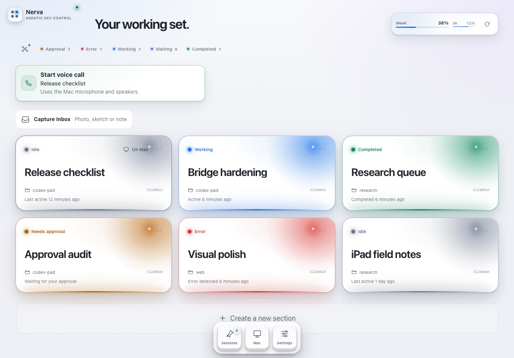
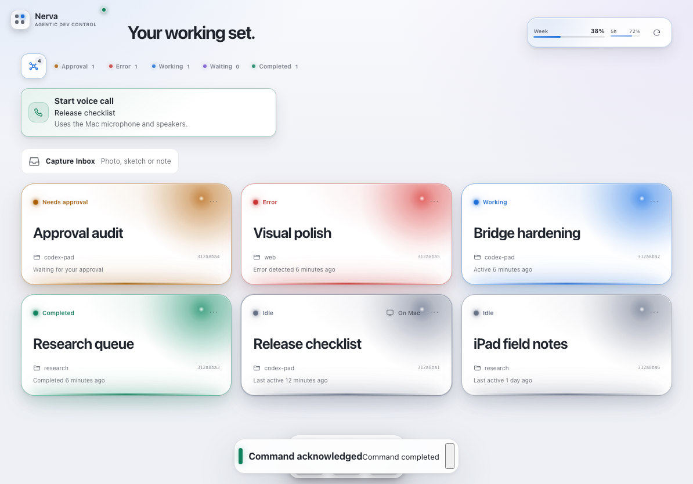
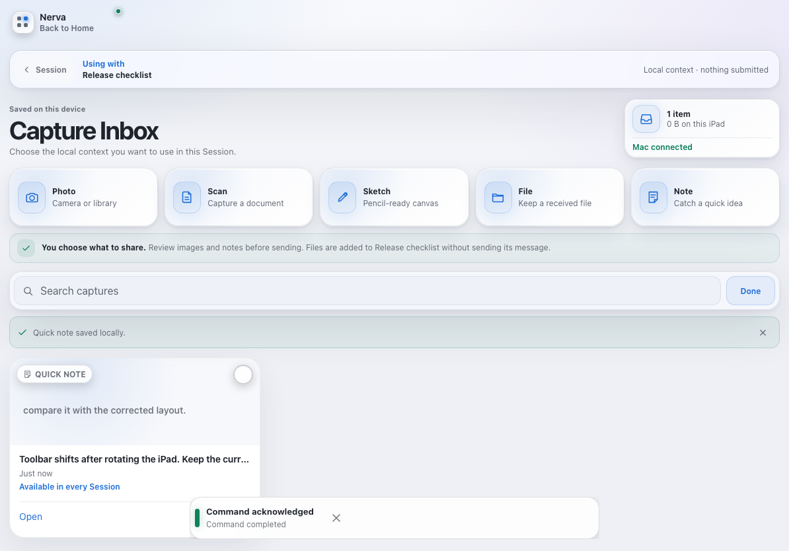
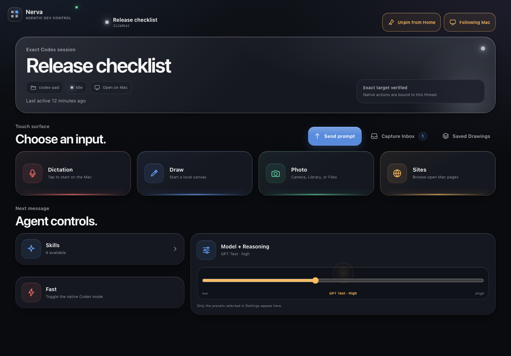
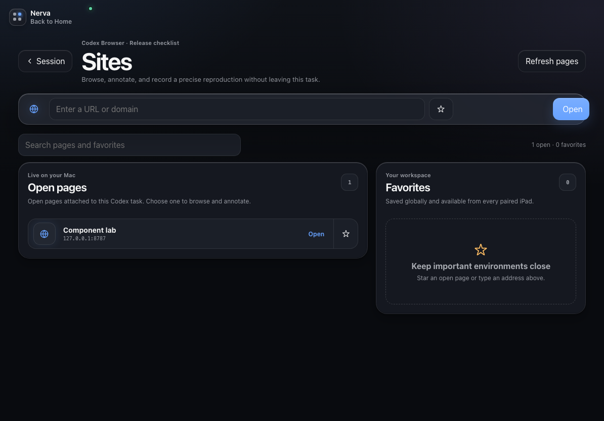
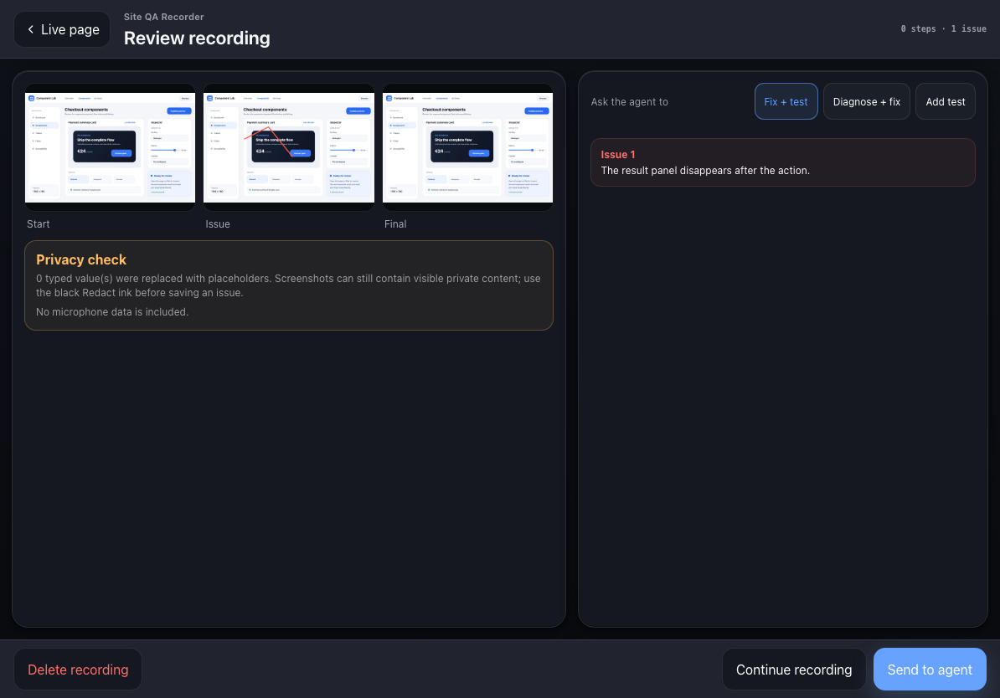
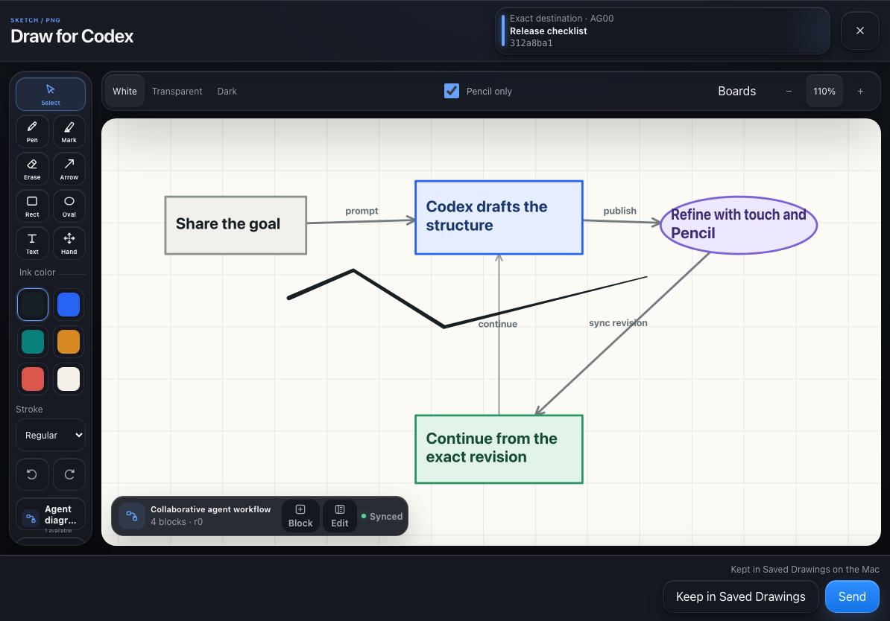
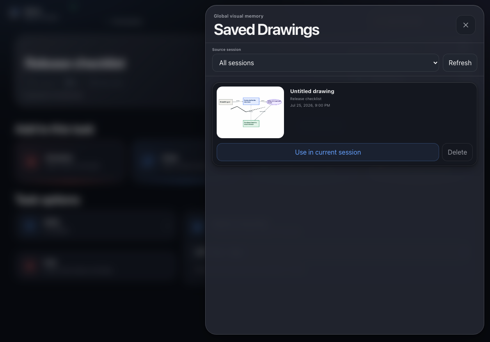
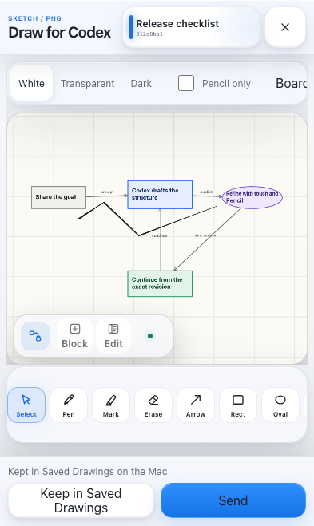
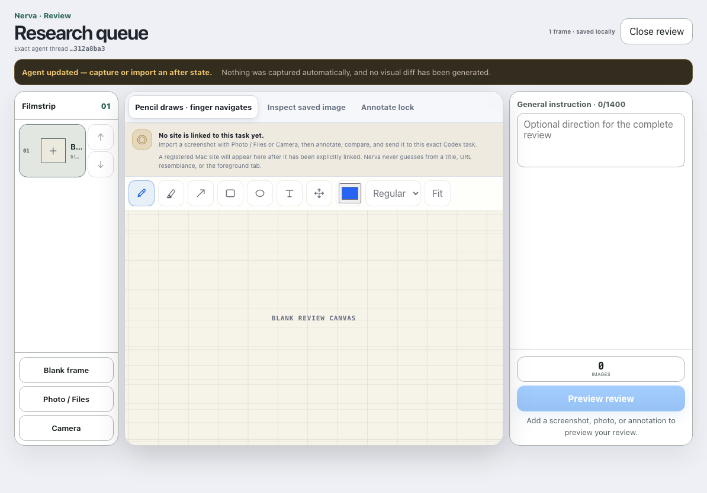

# Nerva

[](https://github.com/blancmathis/nerva/actions/workflows/ci.yml)
[](LICENSE)


Nerva is an independent, touch-first control surface for agentic development on a Mac. Its current production adapter is focused on Codex Desktop: the iPad provides spatial overview, verified controls and visual input, while the Mac remains the source of task execution, native composition and code work.

> **Compatibility naming:** the visible app, installed-PWA metadata and product documentation use `Nerva`. Existing package names, storage databases, launchd identifiers, CLI commands and filesystem paths keep the `codex-pad` / `CodexPad` technical identifiers so upgrades do not strand paired devices or global state.

The current PWA uses one unified Home plus `Home ↔ Capture Inbox` and `Home → Session → contextual surfaces`. Home keeps the exact manual layout for 0–12 pinned sessions and adds temporary priority and status filters across the complete validated catalog. Those filters reuse the same cards, never rewrite sections/cases and replace the former separate Mission Control and Automatic-by-Status surfaces. Capture Inbox collects local photo, scan, sketch, file and note context without assigning it; the same library is then available directly inside any exact Session. A Session provides exact-target navigation, native Mac dictation, drawing, photo import, Capture Inbox, Saved Drawings, skills, reasoning controls and capability-gated review tools.

> **Pre-alpha compatibility warning**
>
> Nerva is not made, supported or endorsed by OpenAI, Apple or Work Louder. Its current Codex native six-slot state/control adapter depends on undocumented Codex Desktop renderer internals and can require compatibility work after a Codex update. Thread messaging uses the installed Codex app-server protocol where its exact capability is proven. No proprietary artwork or extracted application assets are distributed.
>
> **Current local status (25 July 2026):** the code, browser and security gates are green, but the installed Codex Desktop currently exposes seven independent stdio writers and no managed control socket. Nerva therefore reports `degraded` and keeps app-server mutations fail-closed. This public source release is pre-alpha: it is not hardware-validated, tagged or presented as a stable `v0.1.0`; see [Current implementation state](docs/product/CURRENT_STATE.md).

## Source of truth

- [Product documentation index](docs/product/INDEX.md)
- [Current implementation state](docs/product/CURRENT_STATE.md)
- [Runtime reliability and proof boundaries](docs/RELIABILITY.md)
- [Confirmed product specification](docs/product/FEATURES_target.md)
- [Site QA Recorder target specification](docs/product/SITE_QA_RECORDER_target.md)
- [Capture Inbox current contract](docs/product/CAPTURE_INBOX.md)
- [Pairing contract](docs/product/PAIRING_target.md)
- [Collaborative diagrams](docs/COLLABORATIVE_DIAGRAMS.md)

`CURRENT_STATE.md` says what is implemented and proven today. Files ending in `_target.md` define the accepted completion bar. Technical documents must not silently present target behavior as live behavior.

## Current implementation

| Surface | Current state |
| --- | --- |
| Pairing | One Mac command, private Tailscale Serve, five-minute one-use QR invitation, install-first Safari flow, installed-PWA scanner fallback, exact-origin bearer and revocable devices. The owner has completed pairing and reopened the Home Screen app without a new daily QR. |
| Home | 0–12 user-pinned sessions with an empty default; a 52 px tablet header band containing compact live `Codex usage`, `Open current Mac session` and Settings beside the floating brand; rich/compact cards; explicit-only unpinning with no fake cards; `Unpinned Sessions`; manual sections/cases with direct long-press touch drag, no separate Arrange mode, a persistent compact `New section` action and accessible move controls. One compact priority button and direct `Approval`, `Error`, `Working`, `Waiting`, `Completed` filters temporarily show matching pinned and unpinned sessions with the same cards. Priority order is pinned attention, other pinned, then unpinned attention; the durable manual layout never changes. |
| Capture Inbox | Neutral local-first library reached from Home for capture/management and from an exact Session for reuse. Photo, document photo, Pencil sketch, file and quick note work without an available Mac. Captures store no destination and remain reusable across Sessions. `Use in session` copies compatible images/notes into that exact Session's local Review; reconnect never sends, replays or queues anything. Non-image files remain local until a real Codex transport exists. |
| Session | Pin/Unpin; explicit `Following Mac` / `Staying here` state with immediate realignment and navigation-only support outside the native six; no whole-page session swipe or hidden traversal gesture; one-tap Home through the floating product mark; return to the previous iPad view; exact Mac open; native dictation and compact native `Send prompt`; cwd-scoped skills automatically grouped by provider; live Model + Reasoning presets with reliable iPadOS touch commit; Fast; approval, error and completed contexts; Draw, Photo, Saved Drawings and an always-visible Site entry point. Sites is a full responsive page with the current Session's proven Codex Browser pages, an explicit HTTP(S) address field and globally synchronized favorites. The selected page opens in a touch-first live browser with annotation and Site QA Recorder. |
| Site QA Recorder | `Record flow` observes only bridge-confirmed actions, stores an unsent local timeline, protects known sensitive inputs with placeholders, supports Pause/Resume, issue annotations, flattened redaction, expected/actual, a local voice clip and mandatory Review, then sends one idempotent English report plus 1–12 approved frames to the exact task. It requests a Playwright proposal after repository inspection; it never captures DOM/network/auth state or auto-runs/replays a test. |
| Reliability | Authenticated `Settings → System Diagnostics` with per-layer state, last proof, exact bridge/Codex/protocol versions, installed-schema compatibility and copyable diagnostics; atomic PWA shell updates; privacy-safe activity; compact Home attention; per-device standards Web Push with a private Mac VAPID sender, safe exact-session/Home-priority deep links and no Lock Screen approval action. |
| Global state | Pinned identities, layouts, preferences, model/reasoning presets and Site favorites are stored atomically on the Mac with optimistic revisions. A persistent field-scoped local outbox protects an iPad layout or preference change until the Mac confirms it; after a revision conflict, only locally changed fields replace the refreshed Mac state. A stale layout client therefore cannot erase newer presets, and a stale Settings client cannot erase a newer Home layout. One bounded migration offers a locally retained non-empty preset list once when an older Mac copy is empty, then returns to normal Mac authority. The bridge also keeps a private display-only copy of the last successful session catalog so pinned cards survive app-server reconnects and bridge restarts. A replacement paired iPad can load the same state. |
| Drawing | Touch/Pencil-oriented editor with strict Pencil-only input, passive one-touch palm rejection, two-finger pan/zoom, interrupted-stroke preservation, shared Camera/Photo Library/Files import, vector draft persistence, bounded image-only PNG attachment to the exact Mac composer, and `Keep in Saved Drawings`. Codex can also publish an exact-task structured diagram: Draw opens it as editable blocks and arrows, keeps Pencil ink in a separate layer, synchronizes optimistic structural revisions back to the Mac, and flattens both layers only for Keep/Send. |
| Saved Drawings | Private Mac-backed store with validated PNGs, thumbnails, source-session filter, independent working copies and manual deletion. Limits: 48 drawings, 8 MiB each and 128 MiB total PNG data. |
| Review | Ordered imported images, annotations, comparison and bounded exact-target app-server delivery. Site Review is a separate live-tab surface with typed browser controls and simple image-only annotation attachment; it does not reuse the Review filmstrip or import tools. |
| Settings | System/Light/Dark, card density, motion, explicit background-alert enable/disable plus category preferences, unavailable haptics explanation, System Diagnostics, model/reasoning presets, Saved Drawings, device revocation and read-only Context Room health. Nerva Cards render strict data documents, never arbitrary HTML or JavaScript. |

The former Cockpit, Spatial, Command Deck and Library implementations have been removed from the current build and test suite. Historical product decisions remain documented only where they explain migrations or explicit non-goals.

## Important fail-closed limits

- Drawing `Send` attaches one PNG to the exact visible native Mac composer and does not submit the composer, create an app-server turn or inject text. It never silently appends a selected skill. The draft remains available for retry/recovery; only a visibly confirmed attachment animates the studio away. A later instruction can be added on the Mac or with native Mac dictation.
- Collaborative diagrams are exact-task, revisioned data documents rather than arbitrary SVG/HTML. `Sync revision` updates the private structured document without touching the composer; `Send` first confirms a dirty revision, then attaches one flattened structure-plus-Pencil PNG without submitting it. A newer Codex revision never overwrites unsynchronized iPad work.
- Session `Send prompt` is a separate compact control that invokes only the exact live native `ACT12` / `CODEX` / `composer.submit` binding for the selected task. Codex Desktop then applies its own configured follow-up behavior (Queue or Steer); Codex Pad does not invent or display delivery state.
- Available skills are organized automatically from their validated provider provenance (`GitHub`, `Computer Use`, `OpenAI Templates`, project, personal or system) without exposing local paths to the PWA. A provider gets a collapsible folder only when it contains at least two skills; a singleton skill stays directly visible. Selection still preserves each exact skill ID. Selected skills are appended in English at the very end of text-bearing payloads composed by Codex Pad. Drawing keeps them armed for the next text-bearing action. Codex Pad cannot intercept text typed or dictated and sent directly from the native Mac composer.
- The installed app-server contract exposes a live `model/list` catalog and exact-target `thread/settings/update`; Model + Reasoning applies only a combination advertised for the installed version. Configured presets are a strict allowlist. A bounded live-catalog default is used only when the user has configured zero presets, never when configured presets are disabled or temporarily unavailable.
- Home reads Codex account limit windows from the installed app-server's `account/rateLimits/read` method. It displays actual percentages and reset times, keeps the last successful reading visibly marked when a refresh fails, and never substitutes a fabricated percentage.
- Site selection never gains authority from title, URL resemblance, foreground state or project name. The user chooses one opaque tab explicitly; the bridge re-attests it before each bounded frame/control/navigation operation. An explicitly entered or favorite HTTP(S) URL can navigate only that proven page; raw CDP, debugger access, client-supplied JavaScript and selectors remain unavailable.
- Apple Pencil pressure/tilt, palm rejection, 60/120 Hz, iPadOS suspension and replacement-iPad restoration still need a recorded physical-device matrix.
- Background Web Push is implemented for the installed PWA after one explicit `Enable` tap. The Mac bridge notifies only an approval, blocking question, error, pinned important completion or grouped ready results. Generic encrypted payloads open only the exact Session or Home's priority focus; they contain no task content and never expose an approval action on the Lock Screen. The reliable event source currently covers the native six slots, and fully suspended iPadOS/Focus delivery still needs the physical checklist.

## Repository map

- `apps/bridge`: loopback-only Fastify bridge, pairing, authenticated API, global state, collaborative diagrams, Saved Drawings, private VAPID/Push subscriptions and sender, device management, native adapter integration and exact-thread transport.
- `apps/web`: installable React/Vite PWA with the unified Home, Capture Inbox, Session, drawing, review, pairing and Settings surfaces.
- `packages/protocol`: shared runtime-validated Zod contracts.
- `packages/codex-desktop`: versioned, degradable Codex Desktop renderer adapter.
- `packages/drawing`: serializable drawing scene, pointer handling and bounded PNG export.
- `packages/review`: ordered review drafts, comparisons and deterministic outbound assembly.
- `packages/site-review`: exact-thread/opaque-project site associations and bounded capture contracts.

CDP and the app-server socket stay on the Mac. The browser receives only the allowlisted bridge API. Production access is private HTTPS/WSS through Tailscale Serve; Funnel is never supported.

## Quick start

Requirements:

- macOS on Apple Silicon;
- Codex Desktop at `/Applications/ChatGPT.app`;
- the official standalone Codex CLI managed by OpenAI's installer;
- Node.js 22 or newer and npm;
- Tailscale signed in to the same tailnet on the Mac and iPad.

From a clean clone:

```bash
git clone https://github.com/blancmathis/nerva.git
cd nerva
curl -fsSL https://chatgpt.com/codex/install.sh | sh
npm run setup:mac
```

The first command is OpenAI's checksum-verifying standalone installer and is needed only when that managed CLI is absent. `setup:mac` then installs dependencies when needed, builds the checkout, verifies the private network preconditions, asks the Desktop-bundled daemon manager to install/start the standalone durable remote-control service, installs Codex Pad's bridge LaunchAgent, sets the Desktop local-daemon opt-in for later GUI launches, configures only the exact loopback Tailscale Serve route and prints the QR. No separate macOS pairing app or second terminal is required.

On iPad, scan the QR in Safari, use **Share → Add to Home Screen**, then open Nerva and tap **Connect**. If iPadOS does not preserve the invitation during installation, use the scanner in the installed app to scan the same still-valid QR again. Later launches reuse the stored credential; there is no daily pairing step.

For an already-installed but unpaired app:

```bash
npm run pair
```

Detailed instructions:

- [Mac setup](docs/SETUP_MAC.md)
- [iPad setup](docs/SETUP_IPAD.md)
- [Collaborative diagrams](docs/COLLABORATIVE_DIAGRAMS.md)
- [Troubleshooting](docs/TROUBLESHOOTING.md)
- [Manual device checklist](docs/MANUAL_TEST_CHECKLIST.md)

For local development:

```bash
npm ci
npm run dev
```

## Verification

```bash
npm run check
npm test
npm run build
npm run check:bundle
npx playwright install chromium webkit
npm run test:e2e
npm run audit:release
npm run context-room:doctor
npm audit --omit=dev --audit-level=high
```

`npm run validate` runs the complete local code gate. These commands prove code, fixture and local-browser behavior; they do not by themselves prove the live Codex Desktop writer topology, Tailscale on another machine, or physical iPad/Pencil behavior.

The opt-in integration test creates and deletes a disposable app-server thread:

```bash
npm run test:integration
```

The bounded feasibility spike separately checks the installed app-server's isolated text-plus-PNG input path:

```bash
npm run spike
```

## Security summary

- The bridge binds to `127.0.0.1`; Tailscale Serve supplies private HTTPS/WSS.
- QR invitations carry a short-lived secret in the URL fragment, never the permanent credential.
- Permanent bearers are per-device, exact-origin and revocable; WebSockets use separate 30-second one-use tickets.
- Mutations require an exact target, runtime validation, freshness checks and idempotent command IDs.
- Layout, titles, site frames and visual selection never become routing authority.
- Uploaded images are bounded, magic-byte checked, decoded and normalized before use.
- Prompts, drawings, credentials and full thread identifiers are not logged by default.
- The PWA is served with `Permissions-Policy: microphone=(self)` for the explicit voice note attached to a Site QA checkpoint. Capture Inbox never requests the microphone. Session Dictation also never records on the iPad: the first tap sends the verified native Mac press, changes the control to **Stop Dictation**, and the second tap sends the matching native release.

Read [SECURITY.md](SECURITY.md) before changing the transport or control boundaries. Report vulnerabilities through [GitHub Private Vulnerability Reporting](https://github.com/blancmathis/nerva/security/advisories/new), never through a public issue.

## Screenshots

Privacy-safe screenshots are generated from synthetic fixture sessions. Pairing, Home, Home Priority, Capture Inbox, Session, Sites, live Site, Drawing and Saved Drawings are captured at iPad landscape, iPad portrait and phone sizes; Working-filter Home, Light Home, Site QA issue/Review, Review images and Settings have focused landscape captures.





















Regenerate them with `npm run screenshots`. They are rendered UI evidence, not live Desktop or hardware proof.

## Independence and licensing

Nerva is released under the [MIT License](LICENSE). Research provenance, direct notices and the lockfile-derived production inventory are recorded in [docs/research.md](docs/research.md), [THIRD_PARTY_NOTICES.md](THIRD_PARTY_NOTICES.md) and [THIRD_PARTY_LICENSES.json](THIRD_PARTY_LICENSES.json). Regenerate the inventory with `npm run licenses:generate`; the release audit rejects drift.

Contributions are welcome; start with [CONTRIBUTING.md](CONTRIBUTING.md) and the [Code of Conduct](CODE_OF_CONDUCT.md). Use the repository issue forms for non-sensitive bugs and feature requests.
