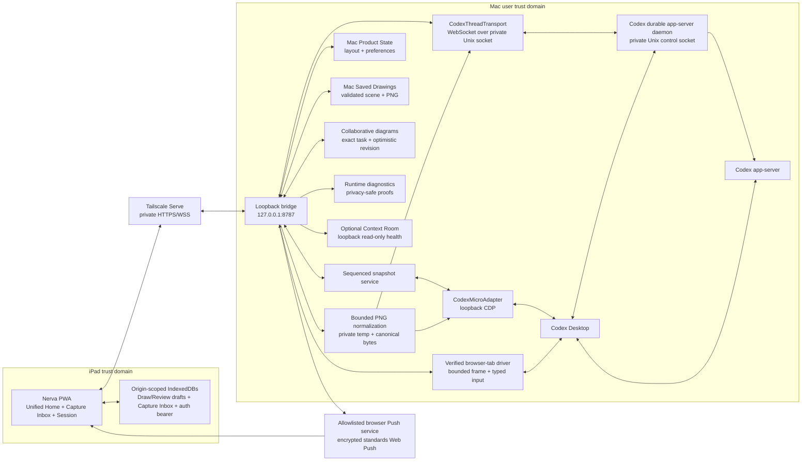

# Architecture

Nerva separates observation/control of the native Codex surface from app-server thread messaging. Drawing/Photo uses one additional bounded native primitive that attaches a PNG to the exact visible composer without submitting it. Review and other text-bearing operations continue to use the app-server only where the installed version supports them. Existing package, storage, service and filesystem identifiers retain `codex-pad` / `CodexPad` for upgrade compatibility.

> **Current implementation boundary:** this document describes the unified Home, `Home ↔ Capture Inbox` and `Home → Session` PWA plus its bridge. Priority/status focus is an in-Home observation/navigation projection, not a separate page or stored layout. Capture Inbox is a separate local-only library available both from Home and from an exact Session. The old Cockpit, Spatial, Library and Mission Control components are not routed. The current six-slot adapter remains authoritative solely for native Micro state and actions it can actually prove; it does not limit Home catalog focus or local Capture Inbox work.

## System shape



Tailscale Serve is the only supported interactive remote entry point. The bridge itself is HTTP/WS on loopback; Tailscale supplies the private TLS boundary. Neither CDP nor the app-server socket crosses that boundary. Background alerts are the one outbound exception: the bridge sends an encrypted, generic payload to the exact allowlisted browser Push endpoint registered by the paired iPad. The Push provider cannot turn that subscription into Nerva command authority.

## Workspace responsibilities

### `packages/protocol`

This package is the contract between browser and bridge. Zod schemas validate snapshots, commands, acknowledgements, health, pairing payloads, and WebSocket messages at runtime. The TypeScript types are derived from those schemas so validation and compile-time shape cannot drift independently.

The snapshot deliberately separates `activeThreadId` from `selectedThreadId`. `activeThreadId` is the exact task currently observed in the Desktop renderer and may refer to a task outside the native six; it is safe only for navigation and display. `selectedThreadId` exists only when the bridge has an authoritative matching native slot and is the identity used by mutation gates. A current Mac task can therefore light the `On Mac` badge while every control remains locked.

Home focus adds no protocol contract. It renders the same runtime-validated `ProductSession` projection already built from the native snapshot and authenticated `/api/sessions` catalog, so manual Home, `Unpinned Sessions`, priority and status filters share one session identity and status source.

Every operation in the finite runtime-validated `/api/command` union includes a `commandId`: `selectAgent`, `runMicroAction`, `runJoystickAction`, `adjustReasoning`, `setModelReasoning`, `respondToApproval`, `createTask`, `sendSketch`, `sendReview`, `runLibraryCommand`, `openSession`, `runSkill`, and `refreshSnapshot`.

`openSession` is navigation-only. The exact target must exist in the current authoritative native snapshot or the last successful runtime-validated `/api/sessions` catalog. If neither knows it, the bridge performs one live catalog check before rejecting it. Consequently, opening a session already displayed by the authenticated iPad does not depend on an additional app-server list request and remains available during a transient reconnect; an arbitrary identifier is still rejected. After validation, the bridge revokes older selected-target proofs and invokes `/usr/bin/open` with one canonical `codex://threads/<uuid>` URL, letting LaunchServices resolve the installed Codex/ChatGPT application. It does not write to app-server.

The web client records an iPad-originated open only to avoid interpreting its matching Mac selection as an unrelated Follow Mac transition. A definitive rejected command clears that marker immediately so later Mac-to-iPad changes cannot be suppressed. Unknown-delivery acknowledgements retain it because LaunchServices may already have received the deep link. Exact-target commands can receive a one-shot authority only after the selected native slot/thread is revalidated at the final write boundary; an operation without an exact target, including task creation, still requires verified shared Desktop ownership.

`acknowledgeCompletion` is represented but currently fails closed until a native completion-revision contract is proven. Pairing, site capture, and device administration have separate bounded endpoint contracts. There is no generic execution command.

### `packages/codex-desktop`

`CodexMicroAdapter` discovers the running Codex Desktop process and a loopback CDP endpoint, selects the main renderer, dynamically resolves version-hashed Micro modules, validates their structure, and projects exactly six slots into the public model. It reads only the minimum state needed for:

- `threadKey` and its trailing thread UUID;
- title;
- native status and activity;
- selected state;
- agent source and native action assignments, including keycap and nullable native-command identity;
- Codex version and adapter health.

The canonical `aria-current` sidebar row is the primary navigation signal, including when the open task is outside the six native Micro slots. Current Desktop builds can leave the composer conversation marker on the previous task after the sidebar and Micro store have moved, so a canonical sidebar identity wins for display/navigation.

If the sidebar identity is unavailable, the adapter accepts a canonical composer identity only when it agrees with the selected native slot or no selected slot exists; with neither canonical DOM signal, it falls back to the unique selected slot. An ambiguous composer/slot disagreement fails closed. Mutation authority remains stricter than navigation: it still requires one selected native slot that matches the observed active task and is revalidated at the final dispatch boundary.

One bounded Desktop migration state is reconciled without title inference. If and only if the selected Micro slot raw key and the current sidebar raw key are the same strict `local:client-new-thread:<uuid>` value while the live composer exposes a canonical conversation UUID, the adapter projects that selected slot as the composer UUID. Native dispatch repeats the same slot/sidebar/composer tuple check at its final write boundary. Composer attachment first refreshes and verifies that exact projected selected slot, then rechecks the sidebar/composer pair inside the renderer immediately before the paste. A different local-key shape, a different selected slot, a missing composer UUID or any canonical disagreement remains ambiguous and fails closed.

Commands become bridge-authored native Micro HID, joystick, or encoder events. For HID actions the browser may only echo the current snapshot's `expectedKeycapId` and nullable `expectedNativeCommandId`. Joystick actions instead echo the live nested `expectedAssignment` `{ type: "command", commandId }`, distinct from the request's idempotency UUID. The browser cannot invent an expression, event name, module identifier, asset hash, or arbitrary payload. The bridge allowlists the identity, and after module discovery the renderer re-reads the live layout immediately before every event and compares the exact assignment. An unavailable or changed assignment fails before the first dispatch; any uncertainty after a press becomes `DELIVERY_UNKNOWN` and is never auto-retried.

The adapter also exposes one fixed `attachImageToComposer` operation. Its input is limited to one canonical thread UUID, the fixed filename `Codex Pad Drawing.png`, and one validated PNG of at most 8 MiB. The renderer expression revalidates the exact visible task, finds one unique native add-context control and its live React paste handler, dispatches one in-memory `File`, and waits for the matching remove-attachment control to appear. It contains no submit call, keyboard shortcut, arbitrary expression or app-server method.

Unknown native statuses map to `degraded`, not `idle`. Failed module discovery preserves a marked-stale last-good snapshot for display but disables controls. See [ADR 002](adr/002-cdp-adapter.md).

### `apps/bridge`

The bridge combines four services:

1. A non-overlapping Micro refresh loop with a cached last-good snapshot.
2. A per-process `bridgeInstanceId` generation plus monotonically increasing in-generation sequence and WebSocket publisher.
3. An authenticated, runtime-validated same-origin HTTP API with a durable command ledger.
4. `CodexThreadTransport` for exact-thread app-server operations.

The bridge binds to `127.0.0.1:8787`. Persistent state lives under `~/Library/Application Support/CodexPad/`; private files are restrictive and atomically replaced. Product State, the VAPID identity and paired-device Push subscriptions are Mac-owned. Logs contain structural diagnostics only.

The browser-facing surface is deliberately small:

| Route | Purpose |
| --- | --- |
| `GET /api/health` | Public, content-free process health. |
| `POST /api/pair` | Exchange one valid five-minute, one-use invitation for a revocable bearer returned once in the response body. The generated QR keeps the invitation in `/pair#pair=…`; the fragment reaches the bridge only in the POST body. |
| `POST /api/ws-ticket` | Use the bearer and exact Origin to mint one origin-bound, single-use 30-second WebSocket ticket. |
| `GET /api/snapshot` | Authenticated full state for start/recovery. |
| `GET /api/usage` | Authenticated Codex account rate-limit projection. Reads `account/rateLimits/read`, exposes only bounded percentages, window durations, reset times and non-sensitive plan/credit metadata, and marks a process-local last-good result `stale` after a transient failure. |
| `GET /api/product-state` / `PUT /api/product-state` | Read or revision-conditionally replace the Mac-owned pinned layout, preferences and model/reasoning presets. A stale revision returns conflict instead of overwriting. |
| `GET /api/push` | Return only whether this authenticated paired device has a Push subscription and the public VAPID key. The endpoint URL and browser subscription secrets are never returned. |
| `PUT /api/push/subscription` / `DELETE /api/push/subscription` | Register or remove the current authenticated paired device's validated subscription after exact-Origin and mutation-rate checks. Registration accepts only known Apple, Google or Mozilla Push service HTTPS hosts and exact Web Push key lengths. |
| `GET /api/saved-drawings` / `GET /api/saved-drawings/:id` | List bounded thumbnails or retrieve one full Mac-owned saved scene and PNG. |
| `POST /api/saved-drawings` / `DELETE /api/saved-drawings/:id` | Explicitly keep or manually delete one validated drawing. Writes require Origin, bearer, rate and concurrency gates. |
| `GET /api/capabilities` | Authenticated transport, library, drawing/review and native-control capability report. |
| `GET /api/native-sessions` | Authenticated lifecycle enrichment bounded to sessions currently present in the native six, including sanitized opaque-project/site association and registry generation. |
| `GET /api/sessions` | Authenticated bounded session listing used by `Unpinned Sessions` and Home. All-session access is part of the accepted product and no longer has a user opt-in toggle. |
| `GET /api/browser-tabs?threadId=…` | Authenticated inventory containing only sanitized HTTP(S) pages whose Codex webview conversation is proven for the exact requested task. Credentials, query, fragment and debugger URLs are omitted. |
| `GET /api/browser-tabs/:tabId/frame?threadId=…` | Authenticated bounded JPEG capture after fresh resolution and exact-task revalidation of one opaque browser target. |
| `POST /api/browser-tabs/:tabId/control?threadId=…` | Origin-checked, authenticated and concurrency-limited typed tap, scroll, text, key or history/reload action after exact-task revalidation, followed by a fresh frame. |
| `GET/POST/DELETE /api/sites…` and `POST /api/sites/:siteId/capture` | Legacy registered-site compatibility for the older Review path. These routes are not used by the visible Sites picker; capture remains independently fail-closed when its process-containment gate is unavailable. |
| `POST /api/command` | Origin-checked authenticated mutation through the finite command union, including bounded sketch/review images. |
| `GET /api/commands/:commandId` | Reconcile an in-flight or completed idempotent command. |
| `GET /api/devices` / `DELETE /api/devices/:id` | List and revoke paired devices. |
| `GET /ws` | Ticket-authenticated display-only state push, ping, and resync; the diagnostic subprotocol is a content-free doctor probe. |

Private HTTP requests use `Authorization: Bearer`; state-changing requests and WebSocket-ticket issuance also require strict Host and exact Origin validation. The PWA offers the fixed base protocol plus the one-use ticket in `Sec-WebSocket-Protocol`, never a URL; the upgrade consumes the ticket against the same Origin and negotiates only the fixed base protocol. The socket is never a mutation transport.

### `apps/web` — current client

The PWA starts with zero pins, renders 0–12 explicitly user-pinned sessions on Home and keeps every remaining idle session in `Unpinned Sessions`. Home stores one visible hierarchy, `section → case → session`, while still allowing loose pinned cards directly on Home. A compact priority button and five status filters temporarily replace the board contents with the same cards from the complete validated catalog; they create no persisted second layout. Moving a card changes presentation only and is available only in the unfiltered manual view. Capture Inbox is a distinct `WorkspaceView` page opened from Home or a Session with that exact `threadId` held only in current navigation state. The product mark returns Home.

Pinned membership and placement are identity-first, but Home never invents a card for an unknown ID. The bridge writes the last successful bounded session projection to a private mode-`0600` cache under its cache directory. When `thread/list` is temporarily unavailable, the bridge may return that sanitized projection with `degraded` status, no selected/native slot, no site association and no mutation authority. Valid cached pins therefore remain visible through reconnection.

A successful catalog response has no deletion tombstones, so omission is never interpreted as an unpin. The client merges omitted last-good summaries as display-only degraded entries and changes saved membership only after explicit `Pin` or `Unpin`. A previously validated cached ID can still support read-only Desktop navigation; commands that require exact native-target authority remain gated by the live snapshot.

Opening a card creates one exact Session context. Manual and Automatic organization affect Home presentation only; they do not define an order inside Session. There is no previous/next rail, whole-page swipe recognizer or hidden traversal gesture. A page drag therefore never opens another task. The floating product mark returns Home in one touch, where the user explicitly chooses the next session. Session keeps native vertical scrolling and controls retain their own touch gestures.

`Pin to Home` is independent from the navigation toggle: the former changes global Home membership, while the latter is displayed as the explicit current state `Following Mac` or `Staying here`. `Following Mac` mirrors later observed Mac task changes. Switching from `Staying here` back to `Following Mac` immediately aligns the iPad with the task already open on the Mac even if no additional Mac navigation event occurs. A saved return affordance restores the previous iPad view after a Mac-follow transition. A navigation-only `On Mac` marker may refer to a task outside the native six and never grants mutation authority.

The Session `Sites` key opens one unified touch picker containing only the current task's proven HTTP(S) pages from the verified Codex Browser renderer. There is no visible linked/unlinked split. Native webview conversation identity establishes task ownership; title, displayed URL, focus and timing never do. Choosing a row is the user's explicit instruction to operate that exact opaque tab inside the currently open Session; it does not create a second persistent Nerva association.

The bridge resolves the opaque tab ID against a fresh attested inventory before every frame or input operation. The PWA receives bounded JPEG frames and may send only the typed controls `tap`, `scroll`, bounded text insertion, four allowlisted keys, back, forward and reload. Debugger addresses, CDP methods, arbitrary URLs, JavaScript and raw protocol payloads never cross the bridge API. The full-screen Site workspace behaves as a live page until Pencil contact—or touch after enabling `Touch + Pencil`—freezes the current frame for simple ink annotation. It contains no filmstrip, blank-frame command, Photo/Files or Camera import. `Send` exports one annotated PNG through the existing exact native composer-attachment path and does not submit the Mac composer.

The service worker caches only the static application shell, including every emitted JavaScript and CSS chunk needed by lazy surfaces such as Capture Inbox, Drawing and Review. Local IndexedDB stores editable Draw and Review drafts per exact target, the structured collaborative-diagram working layer alongside its freehand Draw layer, the separate neutral Capture Inbox, plus a last-good snapshot for stale/offline orientation.

Capture Inbox records never store a Session destination or usage mark; `Use in session` copies compatible content into the chosen exact Review while leaving the original reusable. Inbox bytes never enter the service-worker cache or Mac Product State. The snapshot can contain task titles, thread IDs, slot state and bounded approval summaries, so clearing this origin's site data is the local privacy-removal path for iPad-only records. Raw HTTP response bodies, WebSocket tickets and Codex transcripts are not service-worker cached.

A separate exact-origin `codex-pad-origin-auth` database stores only the permanent bearer record, with a current-page memory fallback when storage is unavailable; no cookie or `localStorage` fallback exists. This avoids sending a host-wide cookie to approved review sites on sibling MagicDNS ports. Legacy cookie names are expiration-cleared during migration and their stored credential records are revoked.

The generic reconciliation list retains at most 64 canonical pending command UUIDs in `localStorage`. A separate drawing-delivery store retains at most 64 immutable per-thread bindings: command/slot/thread identity, expected snapshot sequence, the fixed empty-instruction identity, and the SHA-256 identity of the serialized scene.

Review delivery uses an IndexedDB marker keyed by the target-thread draft and containing only command ID, draft-update time, and creation time. Final success atomically clears only the marker whose thread, draft revision, and command ID match that acknowledgement, while retaining the editable draft and media. A separate confirmed local-clear transaction deletes the review, its matching pending marker, and media not referenced by another draft only if the stored deck still exactly equals the revision displayed by that send panel. Late ACKs and stale panels cannot erase another tab's newer draft or delivery identity. Unknown, in-flight, and failed delivery retain both the review and retry identity.

These recovery records store no mutation body, PNG/base64, raw scene JSON, instruction or transcript text, credential, media, or replay instruction. Reload recovery first uses authenticated `GET` status checks; an explicit retry may re-render the matching IndexedDB draft and reuse the same command ID. Recovery never auto-submits a mutation and fails closed if the target or digest binding no longer matches.

### `packages/drawing`

The drawing engine owns a small serializable scene model. Pointer Events preserve coordinates, time, pressure, and tilt when supplied. Pen input uses pressure-aware `perfect-freehand`. Geometry tools and text remain editable until export.

In Pencil-only mode, non-pen pointers cannot create marks: the first touch remains passive, the second promotes exactly two touches into pan/pinch navigation, and returning to one touch ends that navigation. Touches arriving while a pen is active are not tracked, so a palm cannot later become a gesture accidentally. If WebKit emits `pointercancel` for the pen, the already-rendered samples are committed as a partial element before tracker cleanup. The full-screen studio disables browser selection, touch callouts and overscroll, and its canvas prevents default pointer/select behavior so Pencil contact and a resting palm do not select the surrounding page.

Export is bounded: the scene is flattened into a Retina-friendly PNG, meaningful bounds are padded and clamped, the background is included, and the vector draft remains separate. See [ADR 003](adr/003-drawing-engine.md).

Collaborative diagrams add a validated structured layer above that engine without changing its outbound contract. The Mac store accepts only a versioned 1440 × 900 data document with bounded rectangles/ellipses and referenced edges for one exact task. Draw scales that layer to the current canvas, exposes touch hitboxes for structural editing, and retains ordinary Pencil elements separately. Export merges the current diagram render and Pencil scene into one drawing scene before PNG generation. A dirty structure is written with an optimistic expected revision before Keep or Send; a stale write conflicts instead of replacing a newer revision.

The CLI is the agent-facing publication path. A Codex task publishes a regular bounded JSON file using its exact `CODEX_THREAD_ID`, then can list/get the same task's documents. Continuing an existing document requires both its stable `diagramId` and latest `expectedRevision`. The PWA lists only documents whose `threadId` equals the displayed Session. See [Collaborative diagrams](COLLABORATIVE_DIAGRAMS.md).

Before any imported non-animated PNG, JPEG, static WebP, or structurally supported HEIC/HEIF reaches `createImageBitmap`, `Image`, canvas, or DataURL conversion, the PWA performs a bounded header/magic parse. It retains at most 256 KiB of header/table inspection data, visits at most 4,096 structures, and uses at most a 64 KiB working chunk while a JPEG stream-scans as much as the 15 MiB compressed-file ceiling for late markers. It scans PNG chunks through `IEND`, rejects APNG, animated WebP, and malformed/truncated data, caps every relevant declared or coded dimension at 16,384 pixels, and applies 16-megapixel drawing or 32-megapixel review limits before bitmap decode.

Accepted HEIC/HEIF is limited to an unambiguous primary HEVC image or bounded grid with inspectable item extents and codec configuration. Coded and conformance-cropped display dimensions must agree with the associated spatial extent; in-band parameter sets fail closed; grids are capped at 256 tiles and aggregate coded tile pixels must remain within the caller's area limit. Browser decode dimensions must still match the inspected primary output; the bridge's Sharp normalization remains a final independent defense.

Drawing export re-renders directly from the vector scene toward 92% of the 8 MiB ceiling. The bridge canonicalizes from the original and, if needed, resizes iteratively while preserving a long edge of at least 1,024 pixels; if the exact canonical PNG still cannot fit, the user gets a crop/resize error and nothing is submitted. Review send first inspects every outbound frame and enforces a 64-megapixel aggregate decode budget, then normalizes frames sequentially to at most 8 MiB each and 24 MiB for the complete atomic image bundle. Conversion failure never turns into a partial review send.

The local review schema allows at most 12 frames and 20 image records. Send is stricter: no more than 12 ordered images and an 8,000-character atomic instruction/metadata manifest. Those local-draft and outbound boundaries are negotiated separately.

## Capability-gated extension surfaces

The extension surfaces do not acquire new execution authority. They prepare or organize context around an exact session target.

### Multi-agent focus inside Home

Home deliberately treats each Codex session as one agent unit. Priority and status filters receive the complete `ProductSession[]` already used by manual Home and `Unpinned Sessions`, including pinned and unpinned sessions, and do not enumerate or display a session's internal subagents.

The direct filters are `Approval`, `Error`, `Working`, `Waiting` and `Completed`. Priority includes every pinned session plus every unpinned non-idle session, ordered pinned attention, other pinned, then unpinned attention. Status and recent activity provide deterministic ordering inside those groups. Filter state is component-local, creates no Product State write and does not add a bridge route or catalog.

Selecting a card enters its exact iPad Session and performs the existing navigation-only Mac deep-link. Mac-origin navigation updates global active identity but does not replace Home while a focus is active. Normal Follow Mac behavior resumes after the user enters a Session or returns to the unfiltered layout.

No focus action starts, stops, steers, interrupts, reparents or reassigns an agent. Status observation never becomes mutation authority.

### Multi-frame review and comparison

A review deck contains a bounded ordered set of explicit user imports or future bridge-produced site captures. Each frame has provenance and local annotations. An annotated frame contributes one flattened composite containing its background, rather than duplicating its source capture; unannotated captures and explicit Before, After, or photo items remain distinct and ordered. Every retained outbound image participates in send; the user deletes a frame/image to omit it. Before/after comparison is a view over two explicitly chosen frames; moving a comparison slider does not alter either source.

The bridge advertises `reviewMaxImages` as `0`, `1`, or `12`. A one-image Review uses the normal image/start gate and does not require the private multi-image attestation. When the limit is `1`, a deck containing 2–12 images remains editable locally but cannot be confirmed or sent; the UI never flattens the deck, drops frames, fetches a browser-supplied arbitrary URL, splits it into hidden sends, or silently sends only the first image.

The older registered-route capture remains an independent compatibility driver for image Review. Its Mac-owned registry, exact-origin proxy and browser guards remain implemented, but the production compatibility gate returns `process-sandbox-unavailable` before launching Chrome on the audited Mac. Disabling Chrome's child sandbox is not an accepted fallback. These legacy records are not shown in the current Sites picker and do not authorize its live-tab driver.

Current live Site interaction operates the exact Codex Browser target that the user chooses from the requested Session's scoped inventory. The bridge reads Codex Desktop's browser-webview conversation binding, reconciles client-local conversation IDs only through the exact active sidebar/composer tuple, and omits ambiguous or duplicate mappings. It re-resolves both task ownership and opaque target ID before every frame or gesture and accepts only the typed vocabulary documented in [ADR 007](adr/007-site-review.md). This preserves Mac-only page state without embedding the site or exposing its origin to iPad storage.

### Capture Inbox and native Codex dictation

Capture Inbox exposes no Voice action, calls no microphone API and stores no new audio recording. Its local schema version 2 preserves a legacy voice record only by migrating it to a generic audio file with no destination fields. The bridge still serves `Permissions-Policy: microphone=(self)` for the separate, explicit Site QA checkpoint note defined in [the Site QA contract](product/SITE_QA_RECORDER_target.md). See [ADR 008](adr/008-capture-inbox.md).

Session `Dictation` remains completely separate and never requests the iPad microphone. It is one paired native Micro gesture for the exact selected native task. The first iPad tap sends a `begin` command containing only the native press; its accepted command ID becomes the opaque gesture ID and the control changes to **Stop Dictation**. The second tap sends `end` with that ID and only the matching native release. The bridge retains the exact slot, thread, action and binding captured at begin and rejects a missing, replayed or mismatched end instead of guessing.

The browser echoes only the current snapshot's expected keycap and native action identities. Immediately before each phase, the bridge re-reads the live native layout and requires both identities and the selected slot/thread to match. An absent, stale, changed, or unverified binding disables or rejects the action before its first native event.

Codex Desktop then owns recording and transcription with the microphone selected on the Mac; neither audio nor resulting text returns through Nerva. If the bridge restarts while a gesture is held, the safe recovery is to stop dictation on the Mac; Nerva never fabricates a release. See [ADR 002](adr/002-cdp-adapter.md).

### Home organization and session catalog

Mac Product State owns the ordered pinned IDs, manual sections/cases, loose cards, automatic-group order and global preferences. It is schema-bounded and written atomically. Clients send `expectedRevision`. Every local mutation first records a persistent field-scoped unsynchronized intent for Home layout or preferences.

On conflict, the client refreshes the Mac revision, merges only those locally dirty fields over the new Mac state, and retries; an old Home client cannot erase newer presets, and an old Settings client cannot erase a newer layout. Only confirmation of the resulting desired state clears the outbox. A one-time migration may offer a locally retained non-empty preset list when the Mac list is empty, repairing the previous whole-payload overwrite bug. After that single decision, confirmed Mac state is authoritative again. Local Home and preference storage remain the offline/bootstrap outbox, while the confirmed Mac state is the cross-iPad authority.

Every non-pinned catalog session belongs in `Unpinned Sessions`; there is no `Include all Codex sessions` preference. A session may appear in Home only once, either loose or inside one case. Removing a case returns its sessions directly to Home. Unpinning returns the session to the drawer and never mutates the Codex thread. See [ADR 005](adr/005-spatial-layout.md).

Home has no separate Arrange state. In its unfiltered manual layout, a 420 ms long press starts direct movement on that same contact; ordinary movement before the hold cancels the intent so page scrolling remains available. After activation, card Pointer Events use a six-pixel move threshold, pointer capture and explicit `data-home-drop-target` zones.

Dropping before another card preserves ordering; dropping on a case or the direct-Home board updates only the existing `move-session` presentation action. The card suppresses its synthetic click, and Home temporarily rejects every card-open callback after a committed drop so a DOM reorder cannot redirect that click to another session. Native selects inside each card's compact actions menu remain the non-drag alternative. `New section` stays visible as a compact Home-bar action; section and case management use local controls rather than a global editing mode.

`GET /api/native-sessions` remains a separate compatibility projection for exact UUIDs occupying the native Micro six. It can attach sanitized registry and site association to those exact sessions, but it does not define the full Home catalog and no non-native session inherits Micro controls.

Home's `Codex usage` card is an account-level read, not a task snapshot and not mutation authority. The managed transport calls the installed app-server's generated-schema method `account/rateLimits/read`, prefers the `codex` entry in the multi-limit response, bounds the primary and secondary percentages, converts reset timestamps to JavaScript milliseconds and discards all unrelated payload fields. The paired client refreshes on connect, foreground resume and once per minute while visible and online. A transient transport failure returns the last process-local confirmed reading with `stale: true`; if no reading exists, the API returns `available: false` rather than a fabricated `0%`.

While connected, online and visible, lifecycle refreshes use shared single-flight gates. Transient failures keep last-good orientation; older registry generations cannot overwrite newer context. Because the catalog has no deletion tombstones, a partial response is merged with last-good summaries and omitted sessions become display-only `degraded` entries. Pin membership is changed only by explicit Pin/Unpin actions. Disconnect disables dependent mutations while preserving consultable local state; authentication loss forgets authenticated in-memory catalog data.

### Skills and model controls

The bridge first reads the exact selected thread to obtain its cwd, then calls installed app-server `skills/list` for that cwd. If Desktop exposes the selected native task before app-server can read it, the bridge temporarily uses the global user/system skill catalog instead of showing a false empty list; it never borrows another task's cwd.

Each validated skill path is reduced on the Mac to one bounded group ID. Plugin-cache paths yield their plugin identity such as `github`, `computer-use` or `openai-templates`; global system, personal and project skills use separate fallback groups. The API exposes that group ID with the exact skill name and description, never the absolute path, plugin version or user directory. The PWA formats a provider as an alphabetical collapsible folder only when it contains at least two skills; singleton skills remain directly visible. Selection and prompt assembly continue to use only the unchanged exact skill name.

Periodic exact-thread reads are metadata-only: `thread/read` uses `includeTurns: false`. When the thread is active, the bridge obtains the exact active turn from one bounded `thread/turns/list` request with `limit: 1`, descending order and `itemsView: "notLoaded"`. `thread/resume` likewise uses `excludeTurns: true` with a one-turn metadata page. Nerva never downloads the complete conversation merely to refresh Skills, Review readiness, model controls, cwd or task status; this keeps long-running tasks below the managed WebSocket frame bound without guessing the active turn. Drawing attachment is derived independently from the native renderer.

The Session surface allows multiple selections for the next text-bearing Nerva payload. Assembly appends the English `Use the following skills for this task: …` sentence after every other instruction. A Drawing send is deliberately image-only and does not consume or inject selected skills; they remain armed for the next text-bearing action. The compact `Send prompt` control invokes only the exact live `ACT12` / `CODEX` / `composer.submit` native binding. It submits whatever is already in the Mac composer and therefore cannot inject armed skills or report whether Codex Desktop chose Queue or Steer.

The bridge obtains the installed live model catalog from bounded `model/list` pages, including each model's supported efforts. Settings offers those live model display names and only their advertised reasoning levels; there is no free-form model identifier field. `setModelReasoning` validates the requested combination against that catalog, revalidates the exact selected target, and writes `thread/settings/update`. Once at least one preset is configured, the Session slider treats that ordered list as a strict allowlist and hides disabled or currently invalid entries without substituting any unselected model. The bounded live-catalog default exists only while zero presets are configured. The native reasoning encoder and Fast key remain independently capability-gated against their exact current Micro bindings.

### Saved Drawings

`Keep in Saved Drawings` is the only live-editing transfer to the Mac. The bridge validates the strict request, canonical PNG bytes, decoded dimensions and scene JSON before atomically storing a record and generating a WebP thumbnail. The store keeps at most 48 drawings, 8 MiB per PNG and 128 MiB of PNG data. Opening one produces an independent local working copy; editing that copy does not mutate the saved original. Only explicit manual deletion removes it.

## Snapshot and reconnection model

Each bridge process creates one UUID `bridgeInstanceId`. Within that generation, every accepted native refresh produces a complete `MicroSnapshot` whose `sequence` increases monotonically from 1. A bridge restart creates a new `bridgeInstanceId` and may restart `sequence` at 1, so freshness is the tuple `(bridgeInstanceId, sequence)`, never the number alone.

The foreground path is WebSocket push. WebSocket delivery is an optimization, not the source of truth. On `visibilitychange`, `pageshow`, `online`, or a socket failure, the PWA:

1. reconnects with the last observed bridge-instance/sequence tuple;
2. fetches a full authenticated snapshot;
3. replaces state when `bridgeInstanceId` changes, or reconciles by `sequence` only within the same generation;
4. reconciles pending `commandId` results;
5. keeps the new connection display-only until that exact active socket emits a valid snapshot matching or advancing the accepted tuple;
6. enables controls only after socket attestation, freshness, and target checks pass;
7. leaves unsent IndexedDB drafts untouched.

TCP `open` alone never means the UI state `Connected`, and an HTTP snapshot can update display state without attesting the socket. Queued frames from a replaced socket are ignored. Refresh operations never overlap. Failures use bounded exponential backoff with jitter and no restart loop. A stale last-good snapshot remains visibly stale and is display-only.

Native selection and managed app-server readiness can recover independently and without a new native sequence. Every accepted sequenced snapshot therefore triggers one single-flight refresh of derived capabilities such as Drawing delivery, Skills, and the live Model + Reasoning catalog. While the paired PWA is foregrounded and online, the same small capability document is also polled every two seconds. An early degraded response cannot remain cached for the rest of the installed-PWA session, and an older overlapping response cannot replace a newer capability observation.

The Model + Reasoning range keeps its preview in a synchronous ref as well as React state. Pointer release and keyboard completion commit that exact value, while a short input fallback handles Safari/iPadOS delivering the final range input after `pointerup`. A definitive rejected command returns the control to the last observed live preset; an unknown-delivery acknowledgement does not invent a rollback.

When **Follow Mac** observes a different exact task while Draw is open, the current canvas is persisted to its original thread-scoped iPad draft, the studio is dismissed, and the new Session page becomes visible. The drawing is never rebound or visually reset onto the newly followed task.

## Exact-thread sketch routing

The selected card provides a native `threadKey`; the adapter extracts and validates its trailing UUID. The browser sends the target UUID, a unique `commandId`, and the expected `(bridgeInstanceId, sequence)` authority tuple. It never sends a local path.

Before attachment, the bridge:

1. authenticates the device bearer and validates the exact Origin;
2. validates command shape and size;
3. looks up or reserves the idempotency record;
4. re-reads the current snapshot and checks that the expected slot still contains the exact target UUID;
5. validates, decodes, bounds, and re-encodes the PNG;
6. writes the normalized file under a random mode `0600` name as a private normalization artifact and retains the canonical PNG bytes;
7. refreshes the native adapter and requires the exact thread to remain both active and selected in its expected native slot with `composerAttachment` available;
8. consumes final exact-target authority when Desktop ownership is attested, then invokes the fixed native attachment primitive.

Inside the renderer, the fixed primitive rechecks the exact composer, constructs one in-memory PNG `File`, dispatches it only to the live paste handler, and waits up to 2.5 seconds for the visible `Remove Codex Pad Drawing.png` control count to increase. It never calls `turn/start`, `turn/steer`, a submit handler or a keyboard shortcut. It therefore works while the managed app-server is disconnected, provided the exact native composer remains live.

A definite failure before the paste is safe to retry through the existing durable command identity. Any uncertainty after the paste may have fired becomes `DELIVERY_UNKNOWN`; it is never replayed automatically. Only the visible attachment postcondition marks success and permits the studio animation. The bridge then removes its temporary normalization file because the composer owns the in-memory `File`; no Desktop operation references the local path. Nerva does not display a synthetic `Queued`/`Sent` state because this path submits no message. See [ADR 001](adr/001-thread-transport.md).

The command reservation is written to `security/commands.json` with mode `0600` before execution. The file retains only creator-device audit metadata, command ID, a fixed-size SHA-256 payload fingerprint, timestamps, and the bounded public outcome—never the prompt or image payload. Command-ID authority is global across device revocation and re-pairing; the creator device ID is not an idempotency namespace.

Completed and terminally failed records retain their exact-once authority for a full seven days and expire only after that window; capacity pressure never evicts them early. The production/default schema-bounded capacity is 16,384 records. Interrupted or post-write-timeout records become retryable `DELIVERY_UNKNOWN` entries and are not replayed after restart. In-flight and unresolved records never expire or get evicted; a full ledger fails new mutations closed with an explicit saturation error rather than discarding authority.

Review remains separate from Drawing/Photo. Multi-frame review sends use the same identity and idempotency gates and create one app-server turn containing one deterministic instruction/metadata manifest plus every retained image in order. Its managed-transport idle/steer/busy rules and optional multi-image attestation do not apply to the native composer attachment primitive. Capability negotiation determines the allowed input union; the browser cannot make a transport accept multiple images by changing a client payload. Native dictation is a separate Desktop action and never contributes data to this manifest.

## Typed approval routing

The snapshot exposes at most the selected thread's bounded `pendingApprovals[]`. Each actionable item carries the exact `requestId`, `threadId`, `turnId`, `itemId`, approval kind, actionable flag, and bounded summary observed from the managed app-server. `respondToApproval` echoes the current snapshot sequence and exact tuple plus `accept` or `decline`.

Immediately before the response, the bridge revalidates Desktop ownership, selected native thread, sequence authority, and the still-pending request object. A resolved request or any changed tuple, kind, actionable state, ownership, or target fails closed. Generic `APPR`/`REJ` HID mappings, label matching, and selected-window guesses are not approval mechanisms.

## App-server version matching

The bundled Codex binary inside the installed Desktop app is authoritative for protocol compatibility. Setup and doctor prefer:

```text
/Applications/ChatGPT.app/Contents/Resources/codex
```

Where practical, installed-version protocol schemas are generated into an application-owned cache or temporary validation directory. The current setup path uses the bundled binary's JSON Schema generator, hashes its output, and records a versioned manifest. Generated OpenAI protocol source is not committed. The repository retains only its narrow, stable public projection and compatibility tests.

The optional multi-image capability has a deliberately separate private lifecycle:

1. An operator explicitly runs the standalone probe with disposable-thread acknowledgement, the exact installed Codex version and schema hash, and `--write-attestation`. Normal startup never invokes it. The probe validates those inputs and resolves the executable before it may invalidate existing evidence.
2. The only target is the operating-system account home's `~/Library/Application Support/CodexPad/security/image-input-capability.json`; no environment variable can redirect it. Existing evidence is removed only when its full parent chain and bounded strict private-file shape are safe. Unsafe or unknown content fails closed before app-server launch.
3. Only a complete one-image plus ordered 12-image `turn/start` result followed by confirmed disposable-thread deletion produces the record. Its fixed shape includes `codexBinaryPath`; it contains no prompt, image, thread ID, credential, or local schema path. Publication refuses parent symlinks and existing targets.
4. On every normal start/serve, the CLI locates Desktop, scans the installed-version schema cache, strictly parses each manifest, and recomputes the SHA-256 and ordered file list from all non-manifest files. It accepts only the manifest whose binary path and version exactly match the located installation.
5. The loader then requires the private record's `codexBinaryPath`, version, and schema hash to match that recomputed cache. Invalid, insecure, missing, tampered, or stale evidence projects no capability; absence is the ordinary one-image state.
6. The managed transport finally matches the attested app-server user agent after connection. A match raises only the Review image-count bound from 1 to 12.

This attestation is not mutation authority. It does not prove that Desktop owns or shares the app-server writer, does not select a thread, and does not prove `turn/steer`. Desktop ownership, exact-target authority, current thread state, and idempotency remain independent gates at the write sink.

The managed daemon/control-socket route is experimental. The daemon's Unix listener speaks WebSocket, so the local bridge performs that handshake directly; it does not send raw JSONL to the socket and does not use the SSH-oriented `app-server proxy` byte relay. Its one-shot ownership-generation token is synchronously asserted inside the app-server client at the final WebSocket message write, closing the cooperative bridge/provider time-of-check/time-of-use window. This is fail-closed best-effort topology proof, not an OS isolation guarantee against a hostile or uncooperative same-UID local process. A standalone app-server is suitable for disposable tests, but not as a second live writer against a thread already owned by Desktop.

## Degraded modes

Bridge health and agent status are orthogonal:

- `live`: current renderer and transport checks passed.
- `reconnecting`: a bounded retry is running.
- `stale`: a last-good snapshot is displayed, but mutations are disabled.
- `degraded`: a structural compatibility check failed; the report names the layer without exposing session content.
- `offline`: Desktop or the bridge transport is unavailable.

Drawing and local draft editing remain available during degraded Desktop state. Attachment requires a fresh exact native composer but not app-server readiness; Review delivery and other app-server controls still require their transport gates.

Home, the last-good session snapshot, Draw drafts and Review drafts remain consultable while offline. Mac-owned Product State and Saved Drawings require a fresh authenticated transport to update or fetch records not already held by the current view. Reconnection never auto-submits a draft, and no local surface can bypass a disabled send/control capability.

## Reliability and bounded integrations

`GET /api/runtime` projects independent capability checks, bridge/Codex/protocol versions and installed-schema compatibility. Settings → System Diagnostics renders this document without exposing task contents, local paths or credentials. It is evidence only: it never grants authority.

The PWA update monitor separates worker activation from document reload. A new atomic shell can activate while the old document remains open; Nerva asks the user to reload and disables that action while a Drawing, Review or Site workspace may contain unsaved state, or while a Capture Inbox note, sketch or destructive confirmation is active.

Activity history is derived only from validated status transitions and remains local and bounded. The bridge runs a separate fail-closed notification projection over authoritative native snapshots. It accepts `live`, plus aggregate `degraded` only while the native refresh proof is at most five seconds old; stale, reconnecting and offline snapshots are ignored. It seeds silently after startup and considers only approval, blocking question, error and completion transitions. Completion is important only when its exact task is pinned; completions observed within eight seconds are grouped, and multiple ready pinned results open Home Priority. Other alerts open the exact canonical task UUID.

The installed PWA registers one Push subscription per paired device after the user taps `Enable`. The bridge holds the endpoint, browser keys and persistent VAPID private key in mode-`0600` files, encrypts each bounded payload with `aes128gcm`, uses Push TTL/urgency/topic headers, and drops subscriptions rejected with `404` or `410`. The payload has fixed generic English copy plus a safe Session/Mission target; it contains no title, prompt, output, command summary, local path or approval decision. The service worker validates the allowlist again and exposes no notification action button. Tapping can navigate to a decision but can never approve it.

Only the native six currently provide detailed transition proof. Wider catalog sessions remain visible in Home filters but cannot create a reliable background question/completion event until an independently authoritative status stream exists for them. Fully suspended delivery and Focus integration are implemented through standards Web Push but remain physical iPadOS proof rather than a browser-fixture claim.

See [ADR 009](adr/009-intelligent-web-push.md) for the event allowlist, privacy envelope, subscription lifecycle and rejected Lock Screen actions.

The optional Context Room adapter accepts only an explicit credential-free loopback HTTP origin and reads `/api/health`. Its sanitized result can be rendered as a strict `NervaCardDocument`. Nerva Cards contain a fixed set of data blocks and deliberately have no HTML, JavaScript, CSS, URL or event-handler escape hatch. This foundation does not yet make Nerva a provider-neutral orchestrator.

See [Runtime reliability](RELIABILITY.md) for the canonical current proof boundary.

## Deliberate non-goals

The current Nerva Codex adapter does not implement a source editor, terminal, shell console, general-purpose queued composer, backlog board, iPad speech recognition or multi-agent workflow mutation controls. Capture Inbox has no voice recorder, transcription or send path. Home focus summarizes and navigates existing Codex sessions but cannot create, stop, steer, interrupt, reparent or reassign agents. Nerva may project reliable status into temporary filters, but it never infers progress from manual placement and never changes task state by moving a card. A future Nerva Voice/provider layer is a separate target with explicit permissions and confirmations; it is not implied by the current Context Room health adapter or Nerva Card renderer.

## Current proof boundary

On 25 July 2026, static inspection, unit tests and browser fixtures confirm the current six-slot compatibility projection, exact native bindings, Drawing lifecycle, Product State conflict handling, Capture Inbox, Home focus, Sites, Site QA, Push contracts and privacy-safe System Diagnostics. The installed-version schema cache matches the bundled `codex-cli 0.146.0-alpha.3.1`.

The historical release-baseline local browser matrix passed sequentially and in normal parallel mode: 250 tests passed and eight profile-specific tests were explicitly skipped in each run, with no retries or failures.

The current committed implementation was then reproduced from a separate clean Git clone of `383f5c4`. It passed `npm ci`, Chromium/WebKit installation, `npm run validate`, 902 unit tests plus 11/11 probe-safety tests, build, the 379.69 KiB largest-chunk result, 275 E2E passes with 13 explicit profile skips, the exact collaborative-diagram round trip on all six device profiles, release audit, Context Room doctor, both npm audits and screenshot generation. Axe reported no serious or critical violations on the rendered surfaces.

The native app-server topology is not green on that same date. Doctor observes Codex Desktop `26.721.41059` build `5848`, seven independent stdio app-server writers, no managed control socket and no Desktop ownership attestation. The bridge health endpoint consequently reports `degraded`, with Desktop ownership and multi-image input unverified. Older live daemon, model, skill, session, composer-attachment and dictation observations remain historical compatibility evidence only; they are not current-version proof.

Full Desktop reciprocal-peer authority, a bounded multi-image app-server turn, sustained native Dictation and the complete physical iPad matrix remain unproven. Live Site has an implemented bounded tab driver, but the real Codex Browser frame/control path and physical Pencil-to-attachment flow still need owner verification. Tailscale pairing and installed-PWA credential reuse have worked on the owner's Mac/iPad, but timed clean pairing, replacement-device restoration, Pencil/camera behavior, long suspension, Push wake-up and Focus behavior remain open.

The repository is therefore eligible only for a public source **pre-alpha**: automation is green, while the installed runtime remains degraded and the product is not hardware-ready. No stable `v0.1.0` tag is valid until doctor and the physical checklist are both green.
